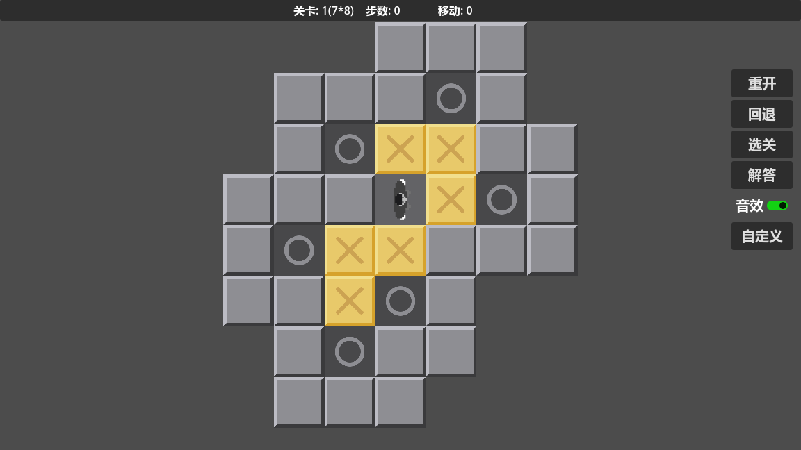
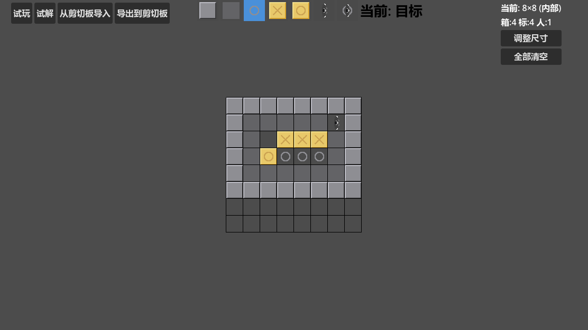

# 🎮 推箱子游戏 (Sokoban)

[](https://godotengine.org/)
[](LICENSE)

> 一款基于 Godot 4.x 开发的经典推箱子游戏，包含完整的关卡编辑器、自动求解器和游戏引擎。




---

## 📋 目录

- [功能特性](#-功能特性)
- [快速开始](#-快速开始)
- [游戏玩法](#-游戏玩法)
- [关卡编辑器](#-关卡编辑器)
- [自动求解器](#-自动求解器)
- [技术架构](#-技术架构)
- [项目结构](#-项目结构)
- [贡献指南](#-贡献指南)
- [许可证](#-许可证)

---

## ✨ 功能特性

### 🎯 核心玩法
- ✅ 经典推箱子规则，支持推箱子和移动分离统计
- ✅ 7 种游戏元素：墙壁、地板、目标点、箱子、玩家、箱子在目标上、玩家在目标上
- ✅ 关卡完成检测与步数统计
- ✅ 撤销操作与重置关卡
- ✅ 支持自定义选关
- ✅ 自动解答器,支持单步前进/后退,快速前进/后退,支持自动播放解题步骤

### 🛠️ 关卡编辑器
- ✅ 可视化地图编辑，支持 3×3 到 100×100 任意尺寸
- ✅ **滑动放置**：左键拖动连续放置，右键拖动连续删除
- ✅ 7 种图块快速切换（快捷键 1-7）
- ✅ 地图导入/导出，支持自定义压缩格式
- ✅ 实时元素计数（箱子/目标点/玩家数量）

### 🤖 自动求解器
- ✅ **IDA* 算法**：内存友好的迭代加深搜索
- ✅ **A* 算法**：备用求解方案
- ✅ **匈牙利算法启发函数**：最优分配箱子到目标点
- ✅ **死锁检测**：自动剪枝无效分支
- ✅ 求解结果编码：`0左移 1右移 2上移 3下移 4左推 5右推 6上推 7下推`

---

## 🚀 快速开始

### 环境要求
- [Godot 4.2+](https://godotengine.org/download)
- Windows / macOS / Linux

### 安装运行

```bash
# 1. 克隆仓库
git clone https://github.com/yourusername/sokoban-game.git
cd sokoban-game

# 2. 用 Godot 打开项目
# 启动 Godot -> 导入 -> 选择 project.godot

# 3. 运行场景
# F5 或点击播放按钮
```
---

## 🎮 游戏玩法

### 控制方式

| 按键 | 动作 |
|:---:|:---|
| `↑ ↓ ← →` / `WASD` | 移动玩家 |
| `Z` | 撤销上一步 |

### 游戏规则

1. **目标**：将所有箱子推到目标点上
2. **限制**：箱子只能推，不能拉
3. **计分**：步数 = 移动次数 + 推箱子次数
4. **完成**：所有箱子覆盖目标点时过关

---

## 🛠️ 关卡编辑器

### 启动方式

```
游戏主界面 -> 自定义
```

### 操作指南

| 操作 | 说明 |
|:---|:---|
| `左键拖动` | 连续放置选中的图块 |
| `右键拖动` | 连续删除图块 |
| `1-7` | 快捷键切换图块 |

### 地图格式

```
E @! *C$ ! C.* !F 
```

- `A-Z`：重复次数（A=1, B=2, ...）
- `!`：换行
- `@ $ . # * + ` ` `：游戏元素

**示例解析：**
```
E @   -> "     @"  (5空格+玩家)
*C$   -> "*$$$"    (箱子在目标+3箱子)
C.*   -> "...*"    (3目标+箱子在目标)
F     -> "      "   (6空格)
```

---

## 🤖 自动求解器

### 算法特性

| 算法 | 适用场景 | 特点 |
|:---|:---|:---|
| **IDA*** | 中等地图（< 50×50） | 内存极小，深度优先迭代加深 |
| **A*** | 复杂地图 | 更稳定，启发式搜索 |

### 求解结果编码

```
0 = 左移    4 = 左推
1 = 右移    5 = 右推
2 = 上移    6 = 上推
3 = 下移    7 = 下推
```

**示例输出：**
```
编码序列: 3 3 0 0 2 2 1 5 5 3 3 2 4 2 1 1 3
可读格式: 3(下移) 3(下移) 0(左移) 0(左移) 2(上移)...
统计: 总=17 移=10 推=7
```

### 性能优化

- **位掩码状态压缩**：状态用 `int` 存储，哈希极快
- **预计算距离**：启动时计算所有格子到目标的曼哈顿距离
- **死锁剪枝**：自动识别角落死锁和沿墙死锁
- **匈牙利算法启发**：最优分配箱子到目标点

---

## 🏗️ 技术架构

### 核心类图

```
┌─────────────────┐
│   GameManager   │
│  (游戏状态管理)  │
└────────┬────────┘
         │
    ┌────┴────┬─────────────┐
    ▼         ▼             ▼
┌────────┐ ┌────────┐ ┌──────────┐
│  Game  │ │ Editor │ │  Solver  │
│ (游戏) │ │(编辑器)│ │ (求解器) │
└────────┘ └────────┘ └──────────┘
    │         │             │
    ▼         ▼             ▼
┌─────────────────────────────────┐
│         Node2D                  │
│      (自定义元素展示)            │
└─────────────────────────────────┘
```
---

## 🙏 致谢

- [Godot Engine](https://godotengine.org/) - 优秀的开源游戏引擎
- [Sokoban Wiki](https://sokoban.fandom.com/) - 推箱子游戏百科
- 所有贡献者和玩家！

---

> 🌟 如果这个项目对你有帮助，请给个 Star！
